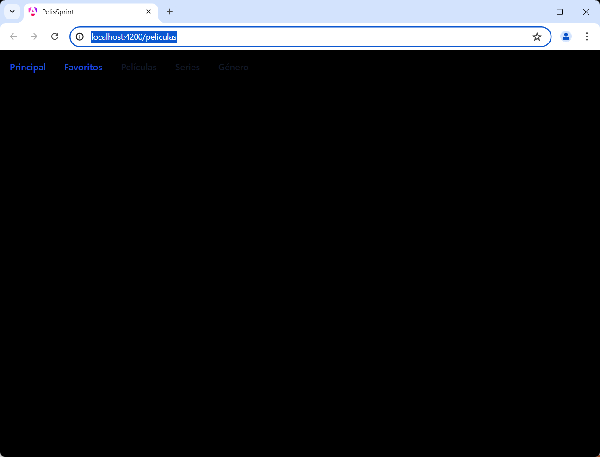
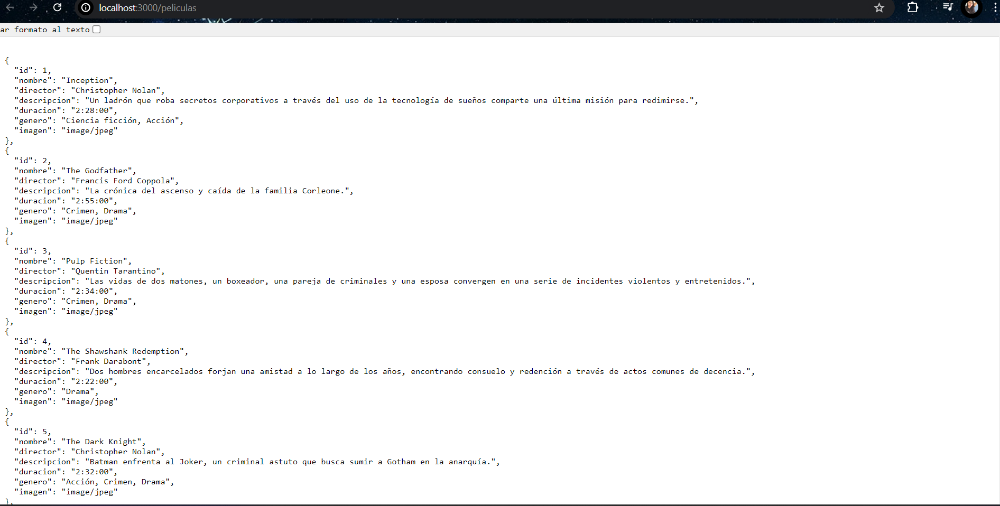
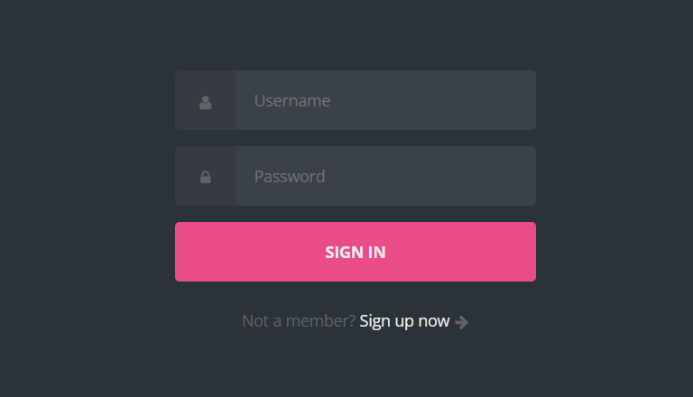
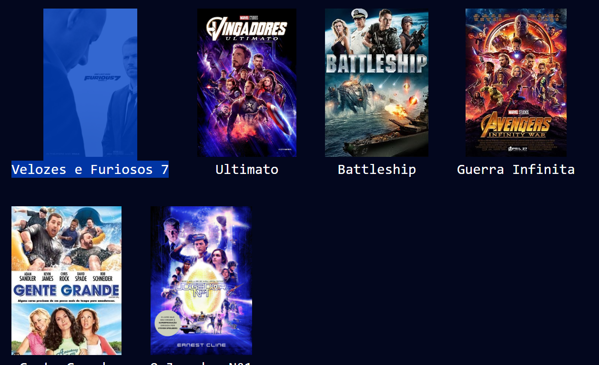

# Title
Sprint 2-3
## Author
Julieta Jiménez

## PelisSprint

This project was generated with [Angular CLI](https://github.com/angular/angular-cli) version 18.1.0.
## Main Objectives
* Use the necessary tools for the creation of a recreational platform for movies and series.
* Make it usable
* Use Html, css, Js
## Development server

Run `ng serve` for a dev server. Navigate to `http://localhost:4200/`. The application will automatically reload if you change any of the source files.
## Programs used
* Node.js: v20.15.0
* Platform Postman: ( https://www.postman.com/)

## Description
* Angular and Node.js were installed, I started with the color scheme of the page.
* I began by adding the Navbar with the help of Tailwind.
* I set up the corresponding routes for the first click on the page.
* I created the document with the movie categories, adding details using JSON and Postman.
* I separately worked on the login part and the platform view using HTML and CSS.
# Complications
1. What did I do wrong?
* I didn't manage my time and focused on another course.
* I focused on the program's errors, restarting it 3 times.
2. What went wrong?
* Initially, I had issues with updating my terminal.
* When placing the routes, I lost track and created more objects than necessary, which           confused me.
* I didn't achieve the objective.
3.  What can I do differently?
* Approach experts in the field to ask questions.
* Manage my time better and not dwell on errors for too long.

Captura1

  
 
Página API creada con json

 
Lo que quería lograr

